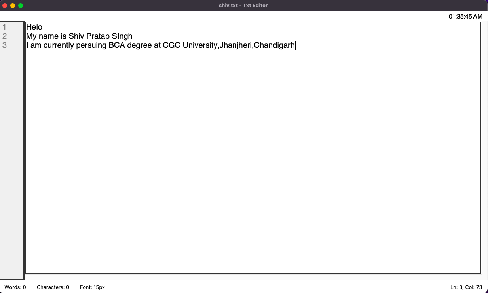
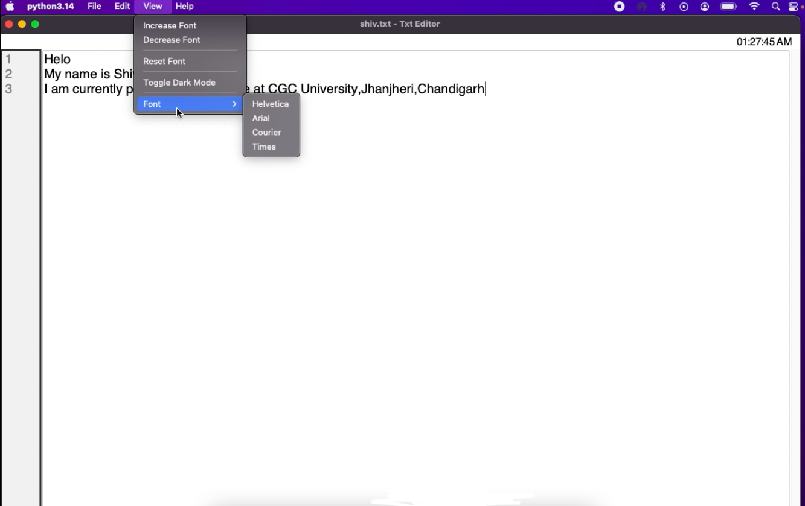
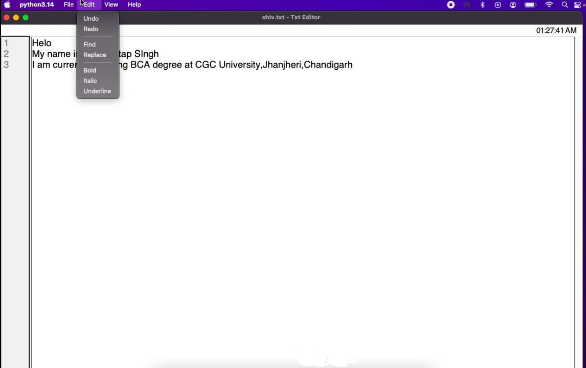
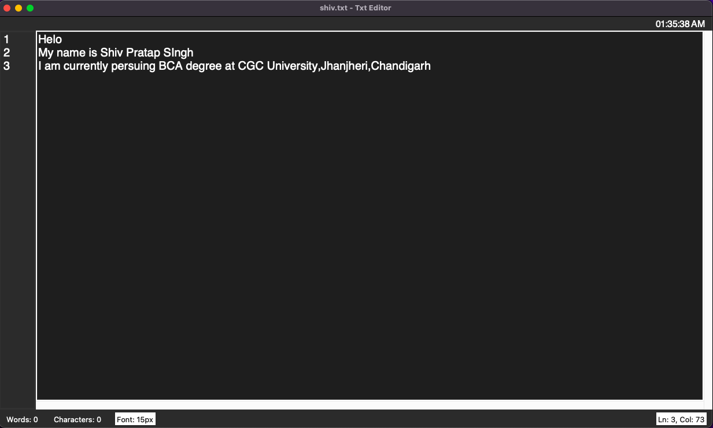

# Text Editor

A feature-rich desktop Text Editor built using Python and Tkinter.

## Features

- Create new text files
- Open existing text files
- Save and Save As functionality
- Unsaved changes warning
- Undo and Redo
- Find and Replace
- Dark Mode
- Full Screen Mode
- Line Numbers
- Vertical and Horizontal Scrollbars
- Digital Clock
- Word and Character Count
- Cursor Position Tracking
- Font Size Control
- Font Family Selection
- Tab Support
- Auto Indentation
- Bold, Italic and Underline Formatting
- Keyboard Shortcuts
- About Section

## Technologies Used

- Python
- Tkinter

## Project Structure

```text
Text-Editor/
│
├── text_editor.py
├── README.md
├── .gitignore
└── screenshots/
```

## Installation

1. Clone the repository:

```bash
git clone https://github.com/your-username/text-editor.git
```

2. Navigate to the project folder:

```bash
cd Text-Editor
```

3. Run the application:

```bash
python3 text_editor.py
```

## Requirements

This project uses Python's built-in Tkinter library.

Make sure Python and Tkinter are installed on your system.

## Screenshots

### Main Editor



### Features




### Dark Mode



## Author

**Shiv Pratap Singh**

Built as a Python Tkinter desktop application project.